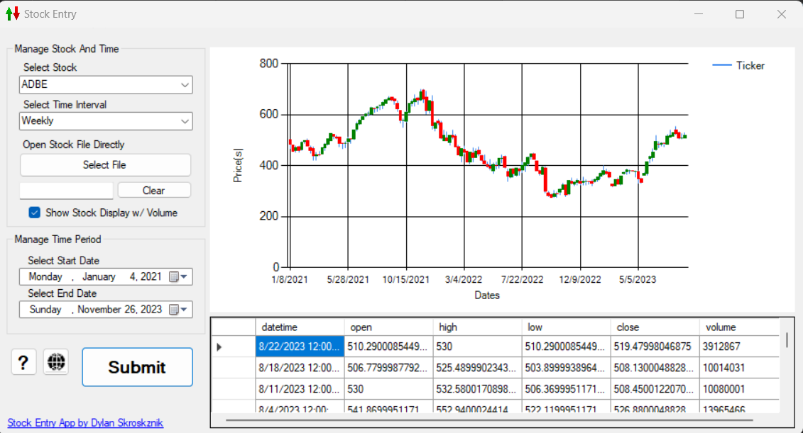
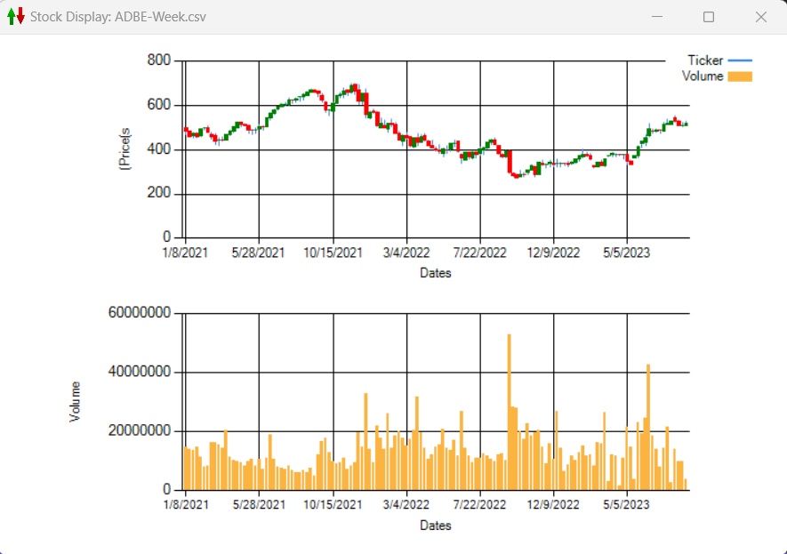

# Stock-Market-Project
Stock Market Technical Analysis Project in C# by: Dylan Skroskznik
---
## Overview
This stock market program is all about analyzing stock market data over predetermined selections made by the user. The stock market is a collection of exchanges through which equity shares of public companies are issued, bought, and sold [1](#references). The role of the stock market is to provide a way for companies to raise capital by selling ownership shares to public investors. At the same time, the stock market allows private investors to buy shares of stock in public companies and become part owners of their businesses [1](#references). 
The main objective of this program is to thoroughly, accessibly, and informatively demonstrate and represent object-oriented programs, user-to-data interaction, and technical analysis.

## Contents
- [Installation](#installation)
- [Documentation](#documentation)
- [Features](#features)
- [Screenshots](#screenshots)
- [References](#references)
- [License](#license)

## Installation
1. **Clone repository to desired directory**
   ```bash
   git clone https://github.com/dskroskznik/Stock-Market-Chart-Program.githttps://github.com/dskroskznik/Stock-Market-Chart-Program.git
2. **Select and Open project solution file in Visual Studio**
   ```WindowsFormsStockApp.sln```
3. **Restore required NuGet packages necessary for the project**
4. **Build and Run**

## Documentation
Navigate through the Microsoft .NET documentation for resources and guidance on Microsoft Visual Studio.
  - [learn.microsoft.com/dotnet](https://learn.microsoft.com/en-us/dotnet/)

## Features
1. **ComboBoxes for Candlestick Pattern Selection**
   - Users can select different stock tickers available using ComboBoxes.
   - ComboBox dynamically updates based on changes in user selection.
2. **File Selection for Candlestick Data**
   - Users can choose individual CSV files directly containing stock data.
   - File selection allows for alternate use of analyzing the datasets.
3. **Date Interval Selection**
   - Users can specify a date interval to focus the analysis on a specific time range.
   - This can be beneficial in examining wider trends and patterns within a defined period.
4. **CSVHelper Class Integration**
   - The program uses CSVHelper to assist in parsing candlestick data from the selected file, which simplifies and improves structure.
5. **Onboard Spreadsheet for Selected Stock Data**
   - Displays a dedicated table within the application to showcase selected stock data.
   - Users can interact with the table to explore specific details of the chosen dataset.
6. **Stock Market Chart Display**
   - The window displays a visual representation of the stock market data using a candlestick chart.
   - Candlestick data plotted on the chart can be closely analyzed by mouse over of each candlestick to view more details.
7. **User-Friendly Interface**
   - Access to helpful resources for more information or real-time activities on specific stocks are available on the form.

## Screenshots 
### Main display of active stock file selected and submitted to the form.


### Additionally available window for a comparison view of a candlestick chart and associative volumes.


## References
[1] Duggan, W. (2022, March 16). Investing Dictionary / Stock Market Definition. Retrieved from US News And World Report: https://money.usnews.com/investing/term/stock-market

## Licensing
This project is licensed under the Standard Apache License - see the [LICENSE.md](LICENSE.md) file for details.

